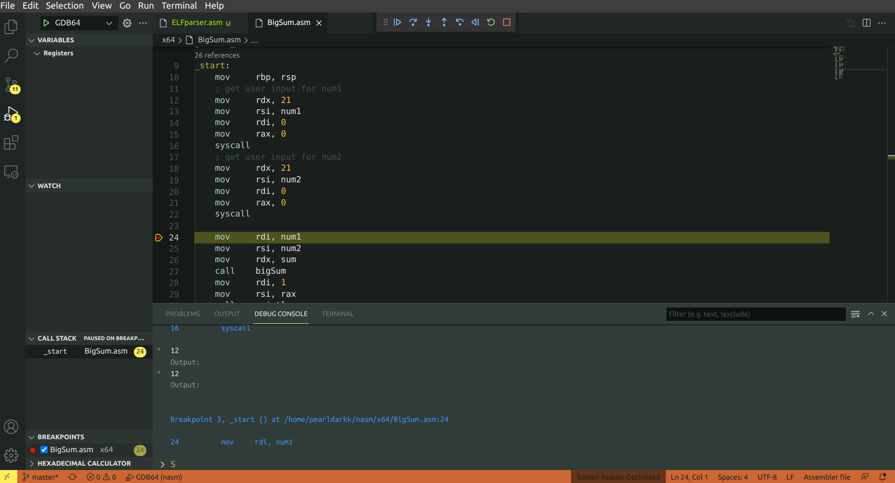
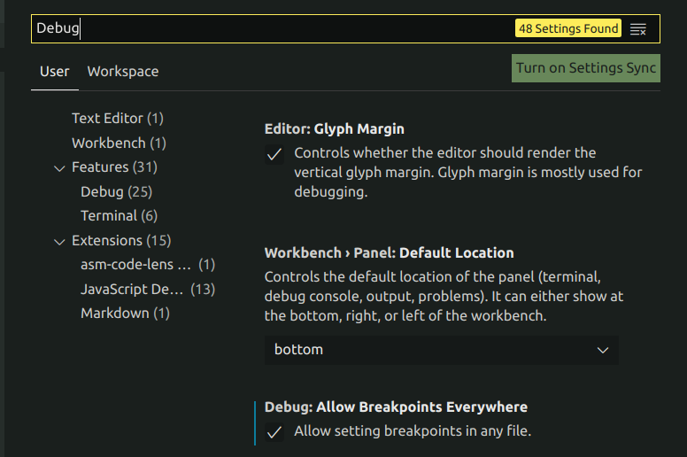

# Vscode nasm Debugging Tutorial  
  
## Screenshot
  
  
  

## What it supports:
- x86 nasm Intel/C library
- x64 nasm Intel/C library
  
## Requirement
- VS code 
- gdb
- Asm Code Lens (for syntax highlighting)  
Install:  
Press `F1` inside VS code and type in: `ext install maziac.asm-code-lens` (or search for this extension to install)
- GDB Debug (for debugging)  
Install:  
`F1` inside VS Code and type in:  `ext install DamianKoper.gdb-debug`  

## Configurations
Put [this config folder](/.vscode) into your workspace folder
- task.json: Contains some build task options, default is 'asm64' which is for x64 nasm Intel syntax. You can change which task is default or not.
- launch.json: Some debug options for correctsponding build task.

## Some special notes
  
Remember to build task befor debug!

### *How to add breakpoints*?  
Go to File > Preferences > Settings > Search for "Debug" and tick the AllowBreakpointsEveryWhere.
  

 
### *Where to type in your user input?*
Press `ctrl + j` and go to the "Debug Console" panel to type in your input! (shown in screenshot above).  

### *Where to watch my registers?*
Go to Variables > Registers in the Debug view.  
  
    
    
Hope it helps!